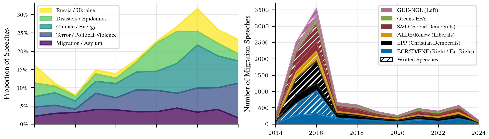
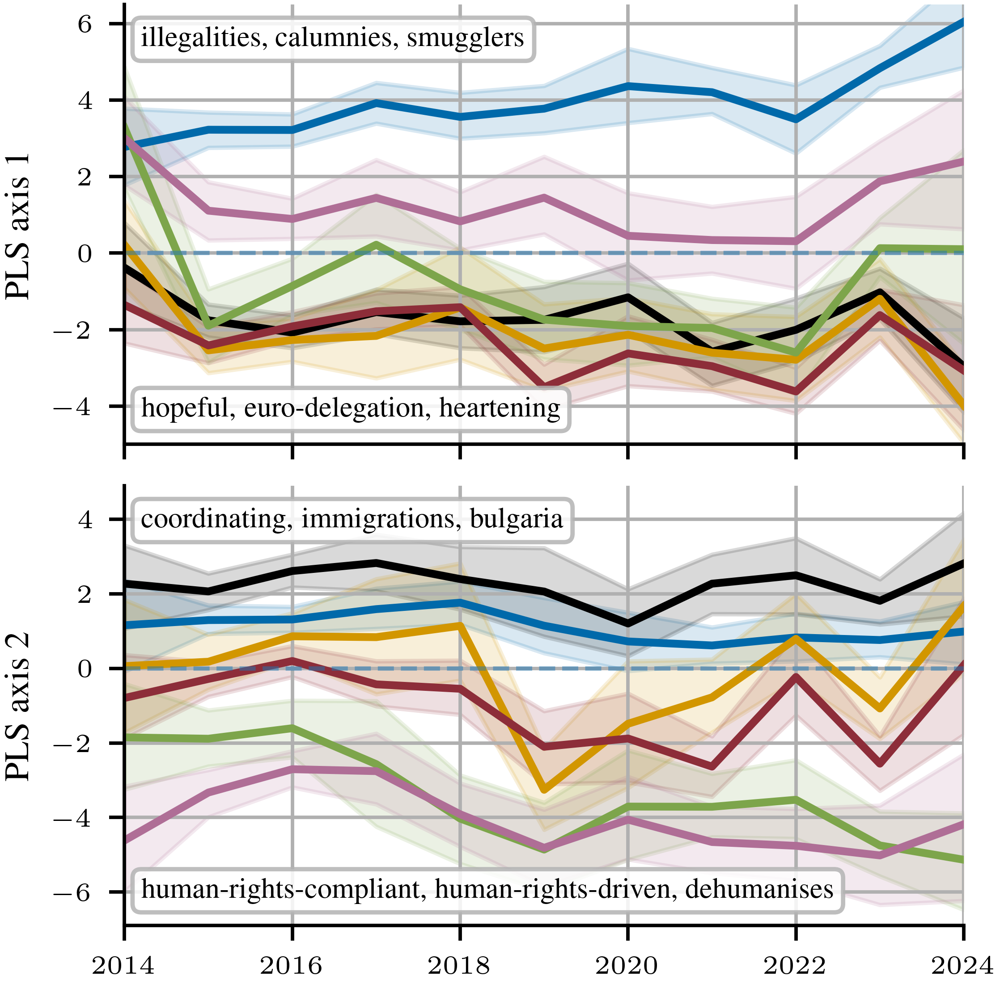
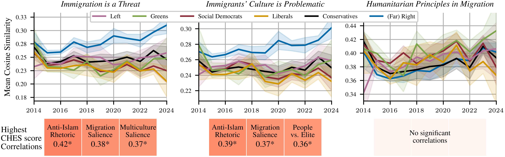

# Deconstructing a Decade of Migration Discourse in the European Parliament
This repository contains the code to reproduce the analyses of the research project "Deconstructing a Decade of Migration Discourse in the European Parliament", conducted for Data Literacy by Prof. Hennig in the winter term 2025/26. 

## Findings 

<table width="100%">
  <tr>
    <td width="30%">
        
    </td>
    <td>
      <p>
        <strong>Quantifying Migration Discourse</strong><br>
        <!-- TODO: add description here -->
      </p>
    </td>
  </tr>

  <tr>
    <td width="30%">
        
    </td>
    <td>
      <p>
        <strong>Differentiating Migration Discourse</strong><br>
        <!-- TODO: add description here -->
      </p>
    </td>
  </tr>

  <tr>
    <td width="30%">
        
    </td>
    <td>
      <p>
        <strong>Migration narratives</strong><br>
        <!-- TODO: add description here -->
      </p>
    </td>
  </tr>
</table>


## Data 
The data can be downloaded from this drive [here](https://1drv.ms/f/c/3670b767c48f3a5a/IgBsXCcCz6fkSorwOSCBCmbcAQafr4adbAmXrhAeawosNGU?e=UJoUiq).
It contains:
- Initially collected data, on which the preprocessing was employed ('original/...')
- Data, resulting either from various preprocessing steps (and/or being input to further steps in the pipeline) or from exploratory analysis ('intermed/...')
- The 'final' data, on which the conclusive analysis (and plot generation) was performed ('final/...')

**To get started:** 
After cloning the repository, download the 'data' folder from the drive (you have read-access, see above) and place it in the project's root.
To install the requirements, use pip:
```
pip install -r requirements.txt
```


### Preprocessing 
The Parllaw speech dataset was first [transformed to .csv-files](src/transform_pls_rds_to_csv.R) and then [preprocessed](src/preprocess_data.py).

#### Translation
*Note: Translation was done before data-preprocessing.*
- [Sending translation requests](src/translation/send_translation_requests.py): To avoid Gemini's rate limits, translation requests are sent in batches of varying sizes, retrying with a smaller batch size after failure. This is semi-automatic so that once no requests are possible anymore due to rate limits, one has to restart later at the point of last successful iteration. 
- [Processing model responses](src/translation/process_translations.py): Once all requests are sent, load and process the model's responses and create a new dataframe with the translated speeches
- [Sanity checks](experiments/preprocessing_checks/pre0_translation_checks.ipynb): To make sure Gemini's translations can be used as a fill-in for Parllaw's missing translations, we checked that *1)* Gemini did not re-formulate speeches that were already in English and *2)* its translations are similar to Parllaw's translations in the embedding space. 

#### Removing non-informative speech parts 
- [Removing commentary](src/preprocessing/remove_commentary.py): Removing frequently used procedural descriptions, language markers and other types of commentary; present inside parentheses with rule-based filtering.
- [Removing formalities](src/preprocessing/remove_repeating_sentences.py): With TF-IDF scores we remove extraneous formalities and decorum frequently present in the openning and closing parts of parliament debates.

#### LDA
*Note: LDA was done on an intermediate dataset created by running the preprocessing-pipeline once. Re-running it added the LDA's topic scores to the speeches.*
- [Identifying dictionary thresholds](experiments/preprocessing_checks/pre2_1_lda_dictionary_thresholds.ipynb): For pre-processing the speeches, this notebook was used to identify what words to remove from the LDA dictionary because they appear too often / little.
- [Fitting LDA models](src/lda/create_lda_models.py): The speeches were preprocessed for LDA by lemmatizing the speeches and creating a filtered dictionary. Multiple LDA models were fit with different number of topics and passes.
- [Evaluating LDA models](src/lda/evaluate_lda_models.py): The different models were compared with respect to their coherence score, whether there is a topic related to migration, and how relevant migration was in that topic.
- [Selecting final LDA model](experiments/preprocessing_checks/pre2_2_lda_model_selection.ipynb): The final LDA model was chosen based on the computed comparison metrics, and through manually checking the fidelity of the created topics.

## Analyses
- Interactive LDA visualization: To investigate the prevalence of migration-related debate in the European Parliament, we created an interactive plot that displays how the debate topics shifted over the years. Run the interactive plot [here](experiments/q1_plot_lda.ipynb).
- Agenda Setting: To explore whether parties engage in 'agenda setting', we explored when they mention migration, and in which contexts. Find the analysis [here](experiments/q2_agenda_setting.ipynb).
- Dimensionality Reduction: To discern how party ideology is encoded in the semantic vector space and how it evolves in the last decade, we try out different dimensionality reduction methods and display our findings. Find the analysis [here (PCA)](experiments/q3_1_pca_interpretation.ipynb), [here (Temporal Trends)](experiments/q3_2_yearly_analysis.ipynb), [here (PLS)](experiments/q3_3_pls.ipynb), [here (Bootstrapping)](experiments/q3_3_x_bootstrapped_pls.ipynb) and [here (PLS stability)](experiments/q3_4_plsda_stability.ipynb)
- Semantic Search: We analyzed whether parties reproduce previously found narratives surrounding migration. Find the analysis [here](experiments/q4_semantic_search.ipynb).


*Note: Due to issues with using LFS, we switched to this repository. If interested in older versions of the project, refer to the [old repository](https://github.com/derkleinejakob/dataliteracy25).*